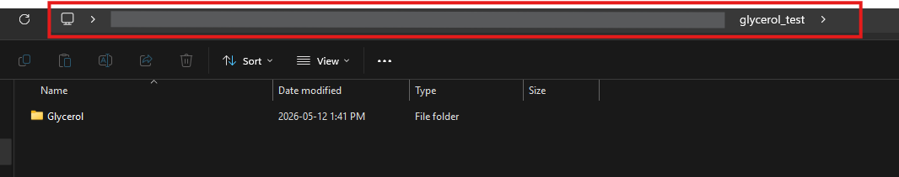
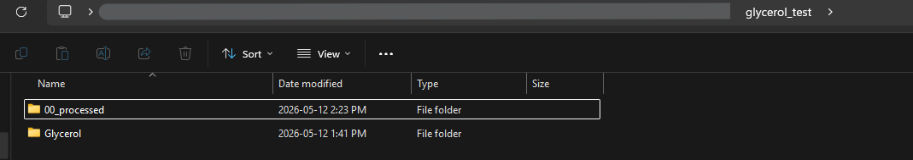

# AERIS: An Automate Extensional Rheology Imaging-based system

This repository contains code for performing and analyzing experiments via AERIS. 

AERIS is an automated extensional rheology analysis platform that was inspired by CaBER (Capillary breakup extensional rheology). It is built on an Opentrons OT-2 liquid handler which is equipped with 3D-printed top and bottom plates, and a high speed camera which serves as our detector to observe filament thinning and breakup. 

Within this repository, you will find:
- Code and labware JSON files for performing an experiment on the OT-2
- Code for Video/Image processing to extract filament contours, compute filament diameters and save to diameter vs time data to csv

------
## Repository overview:
    ├── README.md
    ├── imgprocessenv.yml        <- Environment required for video processing/data analysis
    ├── imgprocessing.py         <- Script for processing the videos acquired using AERIS
    ├── Data_analysis_from_contours.ipynb       <- script for computing the filament diameter vs time.
    ├── AERIS_opentrons_workflow control <- contains all code for Opentrons OT-2 control
    │   ├── README.md    <- contains information on how to run an experiment
    │   ├── aeris_opentrons_control.ipynb   <- notebook that orchestrates the workflow
    │   ├── cleaning_module.ipynb           <- contains the code for the cleaning module
    │   ├── caber_bottom_plate.json         <- AERIS's bottom plate labware definition
    │   ├── caber_topplt_holder_flush.json  <- AERIS's top plate rack labware definition
    │   └── fgl_12_tall_drypad_rack.json    <- AERIS's cleaning module labware definition
    └── AERIS_img_processing
        ├── data_analysis.py                <- computes diameters based on contours (not currently used)
        ├── data_io.py                      <- handles all imports and exports
        ├── filament_contours.py            <- contains all functions to extract filament contours for each frame
        ├── metadata_structure.py           <- structure of metadata file
        ├── plate_analysis.py               <- contains all functions to determine plate boundaries
        ├── preprocessing.py                <- contains all common preprocessing and frame extraction 
        └── user_inputs.py                  <- collects information from user and asks for feedback about processing

------

# How to use this repository

## Downloading and setup
- Download zip file. You can use all this code on either just the computer with the Opentrons software, or on multiple computers. 
- The contents of the `AERIS_opentrons_workflow_control` need to be uploaded onto the Opentrons Jupyter Notebook server (read associated README within the folder)
- The remainder of the code (for image processing and analysis) can be stored locally on the computer, and will work on any Windows system. This pipeline has not been adapted for Mac/linux users yet.

## To perform an AERIS experiment: 
- See associated README for details. 

## To run the image analysis code on your computer: 
### 1. Ensure that your directory looks like the following: 

        ├── AERIS_img_processing           <- This is the module that has all source code 
            ├── data_analysis.py                 
            ├── data_io.py                      
            ├── filament_contours.py            
            ├── metadata_structure.py           
            ├── plate_analysis.py                
            ├── preprocessing.py                
            └── user_inputs.py                  
        ├── imgprocessenv.yml              
        └── imgprocessing.py            * This needs to be outside `AERIS_img_processing` folder  
      
### 2. Set up image processing environment via Anaconda
- Open Anaconda prompt 
- Use `cd` command to navigate to change directories to the location of the `imgprocessenv.yml` file
- create the environment by running the following command: `conda env create -f imgprocessenv.yml`

### 3. Running the code
Use virtual environment of choice (e.g. VSCode) or Terminal to navigate to `imgprocessing.py` and run the script. Follow instructions in the Terminal.

You will first be prompted to enter the file path containing the videos. This is the location of the folder containing the videos you want to analyze, *not* the folder itself. You do NOT need to move your videos to any particular location for this code to work.

In the above image, "glycerol_test" highlighted is the folder that contains the folder "Glycerol". "Glycerol" contains all the videos from the highspeed camera.

- Make sure the address is pasted as a path (no quotations) and not as a string (with quotations)
- Hit enter

### *What to expect*:
- You will be taken through a series of steps to identify the videos you want to analyze, crop the videos (find the region of interest), identify plate boundaries (required for a pixel to mm calibration), and extract contours. 

- If you don't have one already, the code will create a folder named 00_processed at the file path you provide to initiate analysis. This is where all the analysis and associated metadata will be exported

    

    - All plate boundary information, cropping parameters, analysis parameters etc. is stored as metadata in a JSON file
    - All extracted contours are exported as .npz files. 
        -   These files are arrays with shape: (number of frames, maximum contour_length, 3), where 3 is comprised of: y-coordinates with 0 at the top, left contour x-values, right contour x-values.

### *How to use the outputs*
You are free to analyze the .npz files in any way you like. However, we have included a `Data_analysis_from_contours.ipynb` file that can be used to compute the filament diameters from the contours and associated metadata, and save the data as a `.csv` file. You can also use this file to view the contours.

